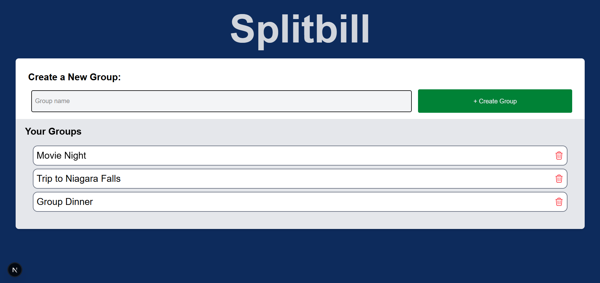
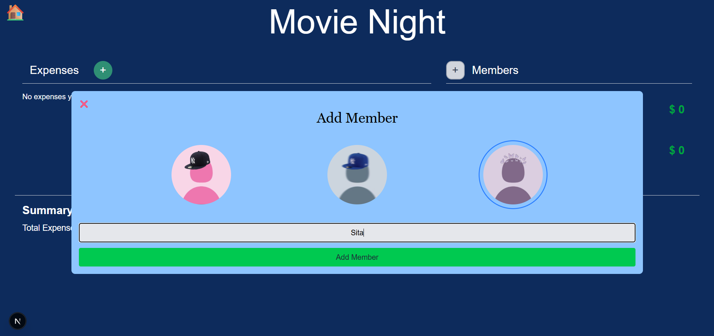
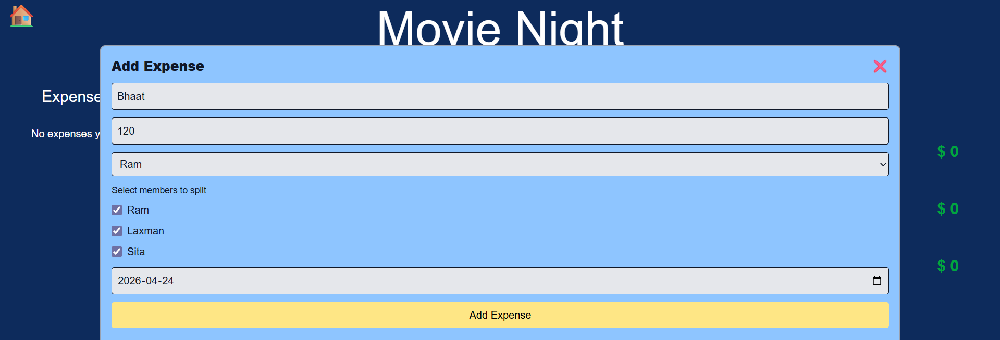
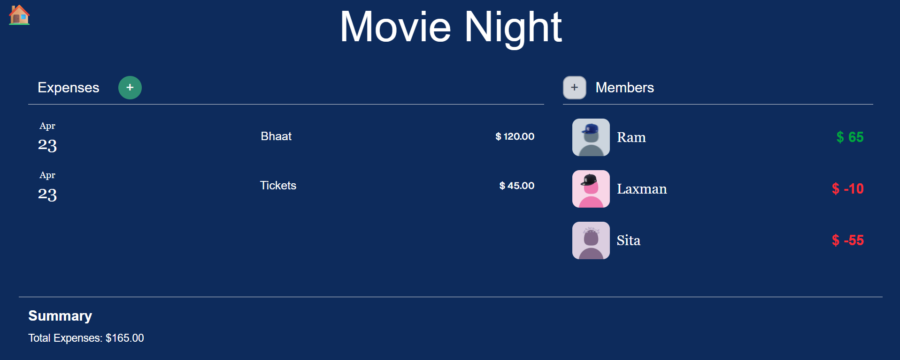

# 💸 SplitBill

A work-in-progress, simple and intuitive full-stack web application to split expenses among friends, roommates, or groups — without the confusion or awkward conversations.

---

## 🚀 Overview

SplitBill helps users track shared expenses and automatically calculates who owes whom. It removes manual math and keeps group spending transparent and fair.

Perfect for:
- Trips with friends ✈️  
- Roommate expenses 🏠  
- Group dinners 🍽️  
- Any shared spending situation  

---

## ✨ Features

- ➕ Add group expenses easily  
- 👥 Track multiple participants per expense  
- ⚖️ Automatic balance calculation  
- 💰 Shows who owes how much to the pot, and who takes how much from it
- 📊 Clear and minimal UI  
- 🔄 Real-time updates

---

## 🛠️ Tech Stack

- **Frontend:** React, TypeScript  
- **Backend:** Node.js, NEXT.js
- **Database:** MongoDB  
- **Styling:** Tailwind CSS 

---

## 📸 Screenshots

## Home Page

## Adding Members

## Adding Expenses

## Group Page

